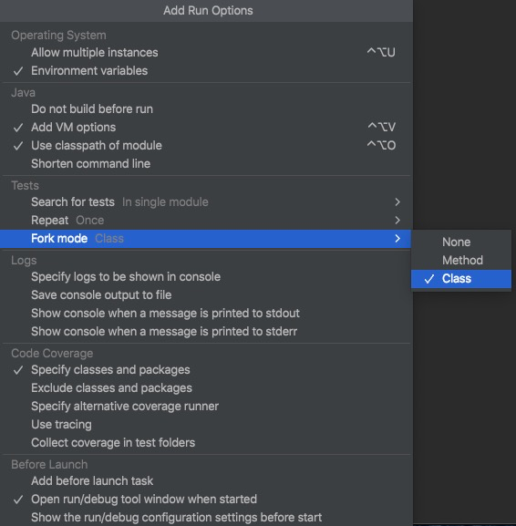

<!--

    Licensed to the Apache Software Foundation (ASF) under one
    or more contributor license agreements.  See the NOTICE file
    distributed with this work for additional information
    regarding copyright ownership.  The ASF licenses this file
    to you under the Apache License, Version 2.0 (the
    "License"); you may not use this file except in compliance
    with the License.  You may obtain a copy of the License at

        http://www.apache.org/licenses/LICENSE-2.0

    Unless required by applicable law or agreed to in writing,
    software distributed under the License is distributed on an
    "AS IS" BASIS, WITHOUT WARRANTIES OR CONDITIONS OF ANY
    KIND, either express or implied.  See the License for the
    specific language governing permissions and limitations
    under the License.

-->

Integration Testing
===================

All integration tests are in this module.

Now integration testing supports three modes, the Local Standalone mode, the Cluster mode and the Remote mode.

Integration Testing with Local Standalone Mode
-------------------

Integration testing with local standalone mode can be run with both maven and IDEs like IntelliJ.

If you want run all tests include UT and IT, the maven command is:
```
mvn clean verify
```

Optionally, you can also only run IT, the maven command is:
```
mvn clean verify -pl integration
```

And if you want to run IT in the IDE like IntelliJ, pay attention to the `fork mode` in `run options`:
you need to change `None` to `class` in `Fork mode`.


Integration Testing with Cluster Mode
-------------------

You can also run integration test in cluster mode. At present, we have implemented a pseudo cluster with five nodes. 
(As the test cases and the test environment are decoupled, we can easily implement three-node cluster or even docker-based cluster.)

The maven command is:
```
mvn clean verify -pl integration -am -PCluster
```

Integration Testing with Remote Mode
-------------------

You can also run integration test in remote mode. The remote server can be a standalone server or a server of a cluster.

The maven command is:
```
mvn clean verify -pl integration -am -PRemote -DRemoteIp=127.0.0.1 -DRemotePort=6777
```

Writing a New Test
-------------------

## What should we cover in integration tests

For every end-user functionality provided by IoTDB we should have an integration-test verifying the correctness.

## Rules to be followed while writing a new integration test

### Every Integration Test must follow these rules:

1) Name of the test file must end with a suffix "IT"
2) A test should be independent of other tests
3) Tests are to be written in Junit style
4) Put appropriate annotation `@Category` on the class or the test level

### About the annotation:
You can put the annotation `@Category({LocalStandaloneTest.class, ClusterTest.class, RemoteTest.class})` on the class or the test level.
And you can use these annotations individually or in combination.

`LocalStandaloneTest.class` stands for you want your test run in the local standalone mode.

`ClusterTest.class` stands for you want your test run in the cluster mode.

`RemoteTest.class` stands for you want your test run in the remote mode.
